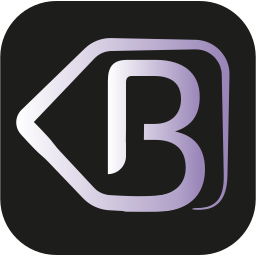
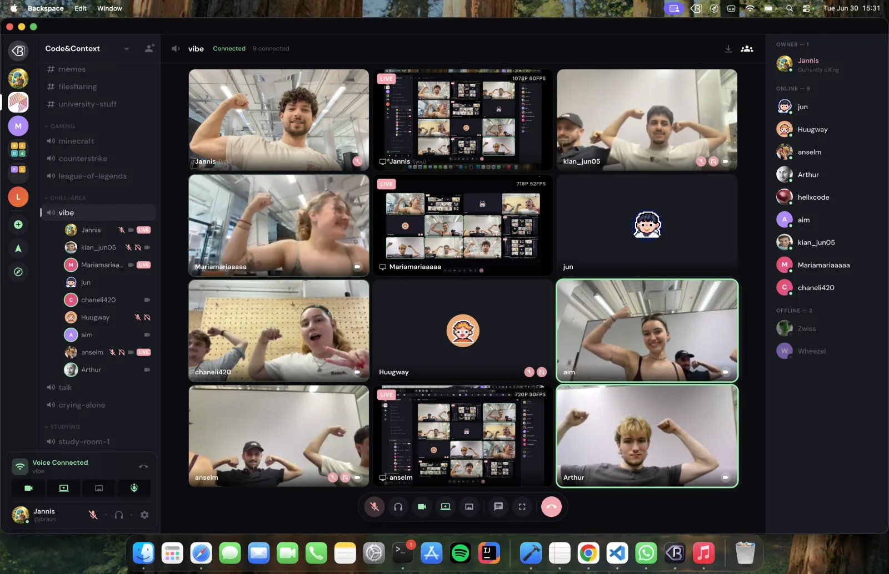
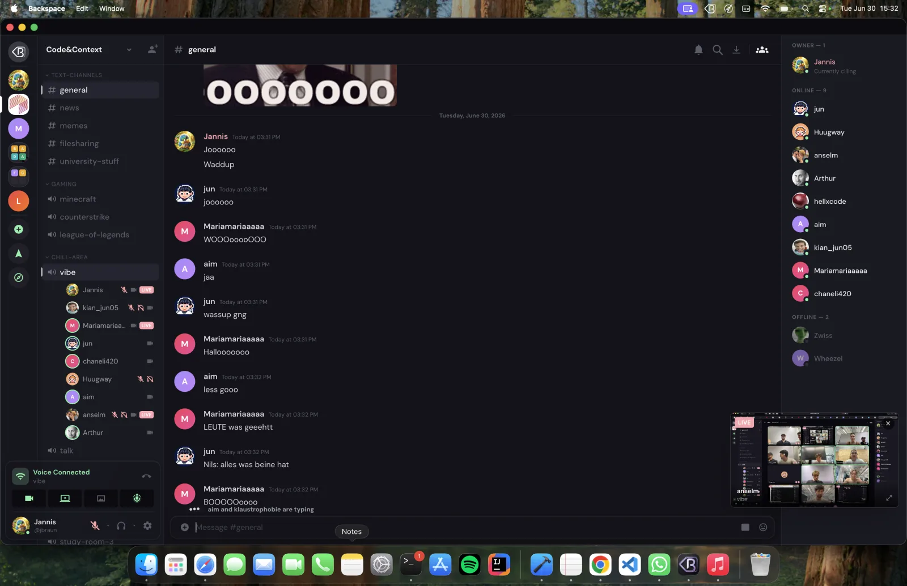
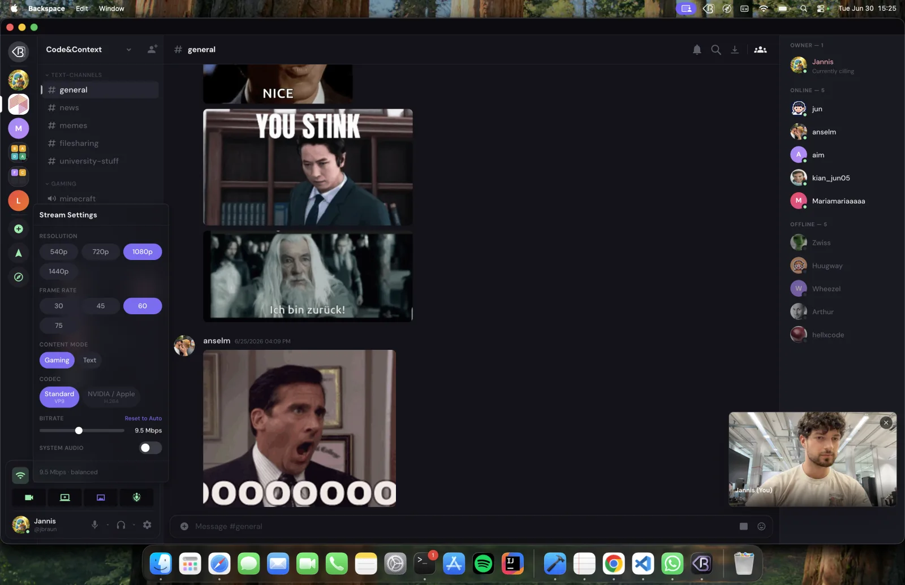
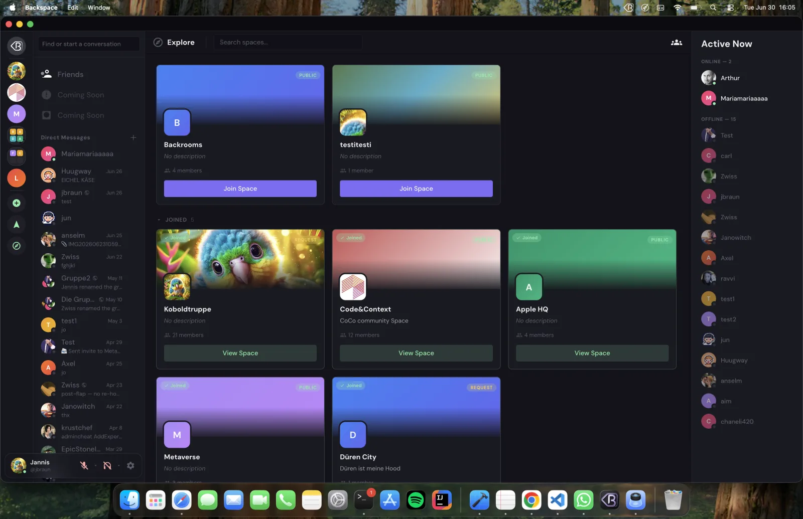
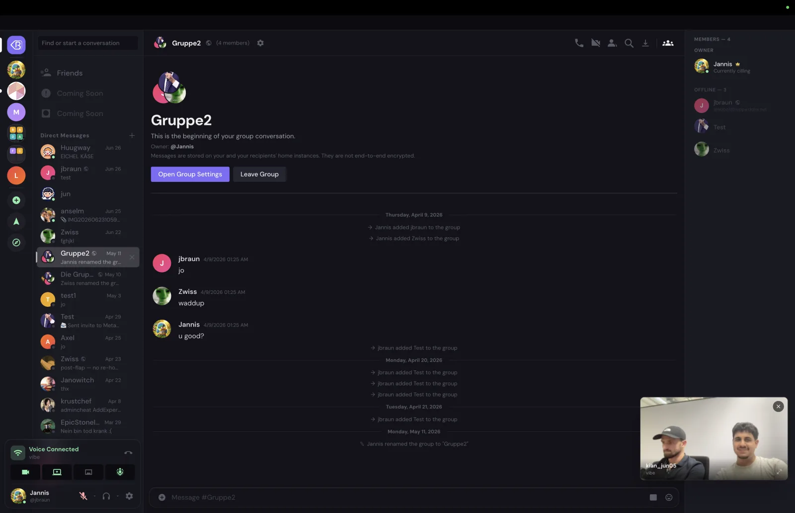
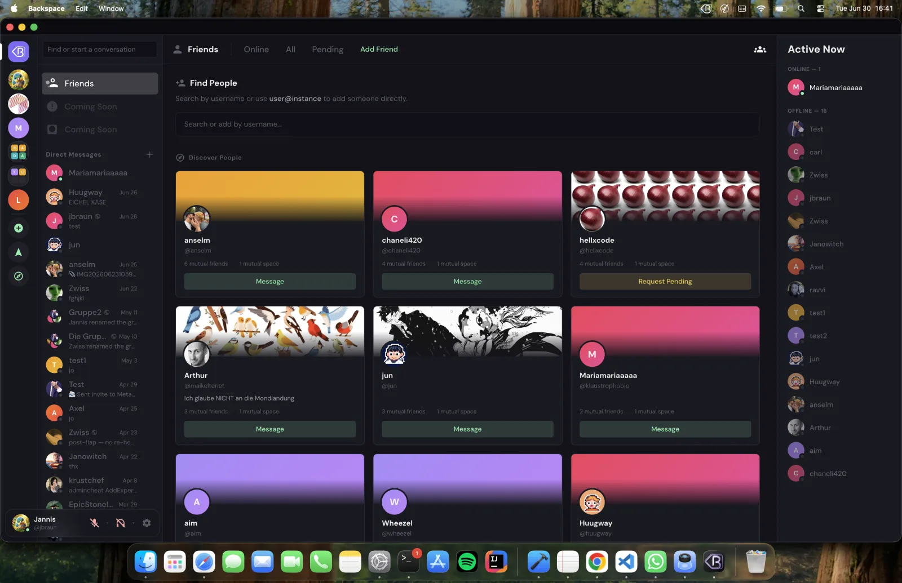
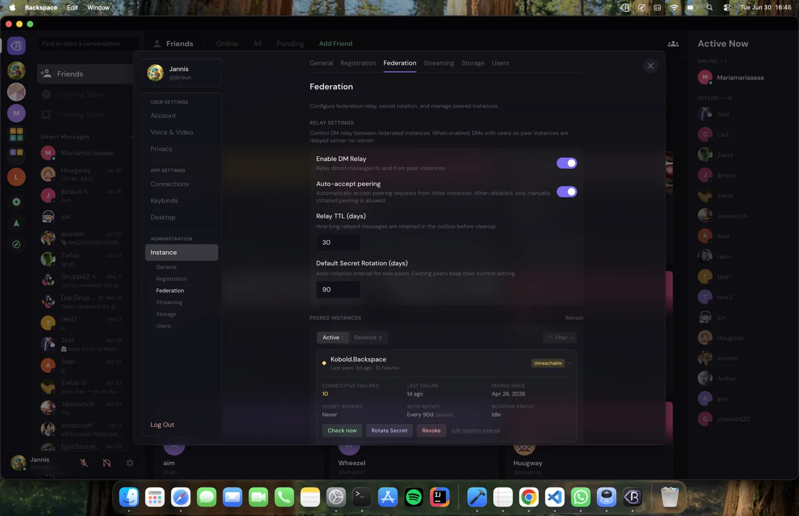

<div align="center">



# Backspace

**A self-hosted communication platform — text, voice, video, and federation — that you own.**

[](LICENSE)
[](https://www.typescriptlang.org/)
[](https://nodejs.org/)
[](#project-status)

</div>

---

Backspace is a Discord-style chat platform you run on your own hardware. Spaces,
channels, roles, voice and video, screen sharing, direct messages, friends, file
sharing, and message search — plus **server-to-server federation**, so
independent Backspace instances can talk to each other while each stays under
its own control.

It is **source-available**: free to self-host, modify, and use — including
inside a business — but not to resell as a hosted service. See
[License](#license) for the exact terms.

> **Project status** <a name="project-status"></a>
> Backspace 1.0 — stable, self-hostable, and actively developed. Running on two
> live instances. A young project; issues and feedback welcome.

## What makes Backspace different

Self-hosted chat usually forces a trade-off: gaming-grade voice and video, *or* a
polished Discord-style experience, *or* federation between independent servers —
rarely all three, and rarely with the fine-grained media controls people expect.

Backspace does all three at once:

- **Voice & video with a real control surface.** Not just "it has screen share":
  choose resolution, frame rate, codec (VP9 or hardware H.264), and bitrate; set
  independent 0–200% volume for every person *and* every screen-share; RNNoise
  noise suppression; a live connection inspector (bitrate, codec, ping, packet
  loss, jitter); and a per-tile badge showing each stream's measured
  resolution/frame-rate. Screen sharing goes up to 4K/120fps within admin-set
  bounds.
- **Federation, not a walled garden.** Run your own instance and peer it with
  others: cross-instance friends, DMs, calls, and presence — each server
  independently owned, requests HMAC-authenticated.
- **A complete, polished platform — not a demo.** Role-based permissions with
  per-category and per-channel overrides, friends and group DMs, inline playable
  media, moderation with audit trails, search, a desktop app, and an installable
  mobile PWA — all in the warm, calm "Aether Drift" interface.

You own the server, the data, and the network it federates into.

## Screenshots

<div align="center">



<sub><em>A voice channel in full swing — camera tiles alongside live screen-shares, each with its own resolution / frame-rate label.</em></sub>

</div>

<table>
  <tr>
    <td width="50%" valign="top">
      <br/>
      <sub><b>Text channels</b> — Markdown, replies, reactions, and live typing indicators.</sub>
    </td>
    <td width="50%" valign="top">
      <br/>
      <sub><b>Screen-share controls</b> — resolution, frame rate, codec, and bitrate, within admin-set bounds.</sub>
    </td>
  </tr>
  <tr>
    <td width="50%" valign="top">
      <br/>
      <sub><b>Spaces &amp; discovery</b> — browse public, request-to-join, and joined spaces.</sub>
    </td>
    <td width="50%" valign="top">
      <br/>
      <sub><b>Direct messages</b> — 1-on-1 and group DMs, including members on peer instances.</sub>
    </td>
  </tr>
  <tr>
    <td width="50%" valign="top">
      <br/>
      <sub><b>Friends &amp; social</b> — find people across instances with mutual friends and spaces.</sub>
    </td>
    <td width="50%" valign="top">
      <br/>
      <sub><b>Federation admin</b> — manage peered instances, relay, and secret rotation.</sub>
    </td>
  </tr>
</table>

<div align="center"><a href="docs/screenshots.md"><b>→ See all screenshots</b></a></div>

## Features

### Communication
- Real-time text channels over WebSocket, with `@mention` autocomplete and mention highlighting
- Markdown formatting with syntax highlighting
- Message reactions, replies, editing, deletion, and per-message mark-as-unread
- Rich link embeds (YouTube, Vimeo, Spotify, and generic OpenGraph) with SSRF-protected scraping, plus GIF search (Klipy)
- Typing indicators, unread badges, and presence
- Direct messages — 1-on-1 and group DMs (up to 10 people), with voice/video calls (ring / accept / reject)

**Voice, video & screen sharing** (via [LiveKit](https://livekit.io/)):
- Screen sharing up to 4K / 120fps — VP9 by default, an optional hardware-accelerated H.264 mode, and a VP8 simulcast fallback
- Per-stream quality controls — resolution, frame rate, codec, and bitrate, within admin-set bounds
- Independent 0–200% volume for every participant *and* every screen-share
- RNNoise noise suppression (on by default), plus echo-cancellation and auto-gain toggles and mic/speaker device selection
- Live connection inspector — per-participant bitrate, codec, ping, packet loss, and jitter — plus a per-tile badge showing each stream's measured resolution/frame-rate
- Screen-share viewer detection ("who's watching") and auto-ducking that lowers stream audio when someone speaks
- Selective subscription — mute or stop watching any camera/stream to save bandwidth
- Push-to-talk and fully customizable keybinds (including mouse buttons), in the browser and the desktop app
- Picture-in-Picture for voice and video

### Organization
- Spaces with channel categories
- Role-based permissions — bitwise RBAC with category- and channel-level overrides
- Customizable user sidebar layout, with personal color-coded folders that group whole spaces
- Space discovery (public, request-to-join, and private)
- Shareable invite codes

### Social
- Friend requests and friendships
- User search and discovery
- Mutual friends and mutual spaces
- User profiles with banner, bio, and accent color
- Presence and rich activities (playing, listening, watching, streaming, custom)
- Manual status — Online, Idle, or Do Not Disturb — with a custom status message
- Privacy controls — toggle discoverability and activity-status sharing

### Moderation
- Bans with reason and moderator attribution (who, why, and when)
- Voice restrictions (space-level mute/deafen, persisted)
- Member move and force-disconnect
- Join-request approval for gated spaces

### Federation
- Multi-instance peering with HMAC-signed server-to-server requests
- Federated identity resolution (`username@instance`)
- Cross-instance DMs — messages, reactions, and membership relay
- Cross-instance friends and presence
- File replication with size validation
- Background workers for outbox delivery, file download, peer health, and cleanup

### Platform
- File uploads with image thumbnails (via `sharp`), drag-and-drop and paste-to-upload, and in-app avatar/banner cropping
- Message search with `from:`, `has:`, `before:`, and `after:` filters, plus jump-to-message
- Admin panel — instance settings, user management, registration controls, storage management, and federation/peering, plus granular streaming controls (a per-resolution × per-frame-rate bitrate matrix, min/max caps, quality-slider step, and an optional user-set-bitrate mode)
- Automatic SQLite backups (pre-migration, scheduled, and manual) with restore tooling
- Electron desktop app (Windows, macOS, Linux) with global keybinds (push-to-talk, mute, deafen) and activity detection
- Native desktop notifications and unread badge counts
- Mobile-responsive web UI with a dedicated touch layout (bottom navigation, swipe gestures, full-screen views)
- Installable PWA — add it to your phone's home screen to run it as a standalone app, with service-worker caching and an offline message queue (messages send once you reconnect)
- Account management — password change and account deletion with safeguards

## Installation

The intended way to deploy Backspace is the **interactive installer** — it
configures everything (`.env`, secrets, HTTPS, optional voice) and brings the
stack up for you. Everything you need for a working instance is below.

### Requirements

- A **Linux host** (VPS, VM, or home server) with **Docker** and **Docker Compose**.
- A **domain name** pointed at the host's public IP — Caddy uses it to obtain
  HTTPS certificates automatically.
- The ability to open the firewall ports in step 2.

### 1. Run the installer

```bash
git clone https://github.com/TheZwiss/backspace.git
cd backspace
./install.sh
```

The installer walks you through everything interactively:

- asks for your domain,
- generates a secure `JWT_SECRET`,
- optionally enables voice/video (sets up the bundled LiveKit server),
- writes `.env` (and `livekit.yaml` if voice is enabled),
- starts all services with Docker and configures automatic HTTPS via Caddy.

### 2. Open the firewall ports

Open these on the host — and, if it's behind a router, port-forward them to the host:

| Port | Proto | When | Purpose |
|------|-------|------|---------|
| `80` | TCP | **Always** | HTTP — Caddy's automatic-HTTPS (ACME) challenge + redirect to HTTPS |
| `443` | TCP | **Always** | HTTPS — web app, REST API, WebSocket, and LiveKit signaling (proxied) |
| `3478` | UDP | If voice enabled | TURN — NAT traversal for WebRTC |
| `7881` | TCP | If voice enabled | WebRTC TCP fallback (clients that can't use UDP) |
| `50000–60000` | UDP | If voice enabled | WebRTC media (voice / video / screen-share streams) |

Without voice, you only need `80` and `443`. The voice ports are required only
when you enable LiveKit. LiveKit's own signaling port (`7880`) stays internal —
it's reverse-proxied through Caddy on `443`, so you do **not** forward it.

> **Do this together with DNS, ideally before (or right after) running the
> installer.** Caddy gets your HTTPS certificate from Let's Encrypt the first
> time the stack starts, which requires your domain to resolve to this host
> **and** ports `80`/`443` reachable from the internet. If they aren't ready
> yet, that's fine — Caddy keeps retrying, and HTTPS comes up automatically once
> DNS and the ports are in place.

### 3. Create your admin account

Open `https://your-domain` and register. **The first account created becomes the
instance admin** — there is no default username or password.

If the page doesn't load over HTTPS, it's almost always DNS or ports `80`/`443`
not being reachable from outside — check `docker compose logs caddy` for
certificate errors. (The installer's health check confirms the app is up
internally, not that the certificate was issued.)

### Backups & restore

The app takes automatic SQLite snapshots (before every migration, on a schedule,
and on demand via `./backup.sh`). Restore from a snapshot with `./restore.sh`.
See [`docs/systems/deployment.md`](docs/systems/deployment.md) for the full
backup/restore and image-pinning guide.

### Manual setup (advanced, optional)

The installer above is the supported path. If you'd rather configure everything
by hand, you can skip it and drive Docker Compose directly — but then DNS,
`.env`, secrets, voice config, and the same firewall ports from step 2 are your
responsibility:

```bash
git clone https://github.com/TheZwiss/backspace.git
cd backspace

cp .env.example .env
# Set DOMAIN, and generate a secret:
echo "JWT_SECRET=$(openssl rand -hex 32)" >> .env

docker compose up -d
```

The stack runs three services via Docker Compose:

| Service     | Role                                              |
|-------------|---------------------------------------------------|
| `backspace` | The app (API + WebSocket + built web client) on internal port `3000` |
| `caddy`     | Reverse proxy with automatic HTTPS for your `DOMAIN` (ports `80`/`443`) |
| `livekit`   | Voice/video server — optional, enabled with `COMPOSE_PROFILES=voice` |

## Development

Requirements: **Node.js 20+** and **pnpm 8+**.

```bash
pnpm install
cp .env.example .env          # set JWT_SECRET (openssl rand -hex 32)
pnpm dev                       # API server on :3005, Vite dev server on :5173
```

Run the halves separately if you prefer:

```bash
pnpm dev:server   # API + WebSocket on :3005
pnpm dev:web      # Vite dev server on :5173
```

Build everything for production (shared types → server → web):

```bash
pnpm build
```

In production the server serves the built web client directly.

## Configuration

All configuration is via environment variables (see [`.env.example`](.env.example)).
The most important:

| Variable             | Required | Default     | Description |
|----------------------|----------|-------------|-------------|
| `DOMAIN`             | yes      | —           | Public domain name of your instance |
| `JWT_SECRET`         | yes      | —           | Auth signing secret, **min 32 chars** (`openssl rand -hex 32`) |
| `PORT`               | no       | `3000`      | App listen port (behind Caddy in Docker) |
| `HOST`               | no       | `0.0.0.0`   | Bind address |
| `REGISTRATION_OPEN`  | no       | `true`      | Set `false` to close signups after setup |
| `MAX_UPLOAD_SIZE`    | no       | `104857600` | Max upload size in bytes (100 MB) |
| `LIVEKIT_URL` / `LIVEKIT_API_KEY` / `LIVEKIT_API_SECRET` | no | — | Enable voice/video |
| `COMPOSE_PROFILES`   | no       | —           | Set to `voice` to start the bundled LiveKit service |

## Voice & Video

Voice, video, and screen sharing require a [LiveKit](https://livekit.io/) server.
The Docker Compose file bundles one — enable it by setting these in `.env`:

```bash
COMPOSE_PROFILES=voice
LIVEKIT_URL=wss://your-domain
LIVEKIT_API_KEY=your-api-key
LIVEKIT_API_SECRET=your-api-secret
```

Enabling voice also requires opening the WebRTC ports (`3478/UDP`, `7881/TCP`,
`50000–60000/UDP`) — see [Open the firewall ports](#2-open-the-firewall-ports).

Without LiveKit configured, everything else — text, federation, DMs, uploads,
search — works fully; only voice/video channels won't connect.

## Federation

Backspace instances can peer with each other so users on different servers can
become friends, DM, and call across instances, while each instance stays
independently owned and operated. Peering is mutual and authenticated with
HMAC-signed requests; identities are addressed as `username@instance`. Manage
peers from the **Connections** panel in settings. The protocol is documented in
[`docs/systems/federation.md`](docs/systems/federation.md) and
[`docs/systems/client-federation.md`](docs/systems/client-federation.md).

## Desktop App

The Electron desktop app wraps the web client and adds a system tray, native
notifications, global keybinds, and activity detection.

```bash
cd packages/desktop
pnpm build:ts    # compile TypeScript
pnpm dev         # run in development
pnpm build       # package for distribution
```

Cross-platform builds are produced for Windows, macOS, and Linux. See
[`docs/systems/desktop.md`](docs/systems/desktop.md).

## Mobile

Backspace works on mobile today — just open your instance in a phone browser.
The UI has a dedicated touch layout (bottom navigation, swipe gestures, and
full-screen views), and because it ships as an installable **PWA** you can use
your browser's **Add to Home Screen** to install it as a standalone app: its own
icon, no browser chrome, and an offline message queue that flushes when you
reconnect.

Native **iOS and Android app-store apps are planned** — once the project gains
traction and the funding for the developer-program licenses is secured. Until
then, the installable PWA is the supported way to run Backspace on a phone.

## Architecture

Backspace is a TypeScript monorepo managed with pnpm workspaces.

```
packages/
  shared/   — Shared types, permission bits, constants
  server/   — Fastify API + WebSocket server, Drizzle/SQLite, federation
  web/      — React 18 SPA (Vite, Tailwind, Zustand)
  desktop/  — Electron wrapper
```

| Layer        | Technology |
|--------------|------------|
| Server       | Node.js 20+, Fastify 4, TypeScript (strict) |
| Database     | SQLite (better-sqlite3) + Drizzle ORM |
| Auth         | JWT + bcrypt |
| Frontend     | React 18, Vite 6, Tailwind CSS 3, Zustand 5 |
| Voice/Video  | LiveKit |
| Media        | sharp (thumbnails), Cheerio (embeds) |
| Desktop      | Electron 40 |
| Deployment   | Docker Compose + Caddy (auto-HTTPS) |

Every subsystem has a dedicated specification under
[`docs/systems/`](docs/systems/) — database schema, REST API, WebSocket
protocol, federation, permissions, voice, the design system, and more. **These
are the reference for how Backspace works**; start there if you want to
understand or extend a subsystem.

## Contributing

Contributions are welcome. Please read [`CONTRIBUTING.md`](CONTRIBUTING.md)
first. Backspace is a single-owner project, so all contributors sign a
[Contributor License Agreement](CLA.md) — a one-time comment on your pull
request, handled automatically by a bot. The CLA **assigns copyright in your
contribution to the maintainer** (Jannis Braun), who becomes its sole owner; in
return you receive a license to reuse the specific code you wrote in your own
other projects. If you're not comfortable assigning your contribution, please
don't submit it.

## Security

If you discover a security vulnerability, please **do not** open a public issue.
Instead, report it privately to the maintainer via a GitHub security advisory on
this repository, or by direct contact. We'll work with you on a fix and
coordinated disclosure.

## License

Backspace is licensed under the **[Elastic License 2.0](LICENSE)**.

In plain terms:

- ✅ You may self-host, run, and use it — including commercially and inside a business.
- ✅ You may read, modify, and redistribute the source.
- ❌ You may **not** provide Backspace to third parties as a hosted or managed
  service (i.e. you can't sell Backspace-as-a-service) without a separate
  commercial license from the maintainer.
- ❌ You may not remove or obscure the license and copyright notices.

This makes Backspace **source-available**, not OSI "open source" — the only
practical difference is the hosted-service restriction above. If you want to
offer Backspace as a commercial service, contact the maintainer
([@TheZwiss](https://github.com/TheZwiss)) about a commercial license.

Bundled third-party components (the DM Sans font, etc.) retain their own
licenses; see [`NOTICE`](NOTICE).

"Backspace" and the Backspace logo are trademarks of Jannis Braun and are not
covered by the code license.

## Acknowledgements

Built on the shoulders of [Fastify](https://fastify.dev/),
[Drizzle ORM](https://orm.drizzle.team/), [React](https://react.dev/),
[LiveKit](https://livekit.io/), [Tailwind CSS](https://tailwindcss.com/),
[Electron](https://www.electronjs.org/), and the broader open-source ecosystem.
The interface uses the [DM Sans](https://github.com/googlefonts/dm-fonts) font
(SIL Open Font License 1.1).
