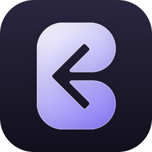

<div align="center">



# Backspace

**Платформа для общения, которую вы держите у себя. Текст, голос, видео и федерация.**

[](LICENSE)
[](https://www.typescriptlang.org/)
[](https://nodejs.org/)
[](https://github.com/TheZwiss/backspace/releases)
[](https://github.com/TheZwiss/backspace/actions/workflows/codeql.yml)
[](https://scorecard.dev/viewer/?uri=github.com/TheZwiss/backspace)
[](SECURITY.md)

[English](README.md) · **Русский**

</div>

---

> Полная и всегда актуальная документация — в [английском README](README.md).
> Этот перевод охватывает то, что нужно, чтобы разобраться в проекте и поднять
> его у себя. Для продвинутых сценариев (свой обратный прокси, туннели,
> разработка, архитектура) смотрите английскую версию: она обновляется первой.

Backspace — аналог Discord с открытым исходным кодом, который вы запускаете на
собственном железе: пространства, каналы, роли, голос и видео, демонстрация
экрана, личные сообщения, друзья, обмен файлами и поиск по сообщениям. Сверх
того **федерация между серверами** позволяет независимым серверам Backspace
общаться друг с другом, и каждый остаётся под управлением своего владельца.

Это **свободное программное обеспечение** под **GNU AGPL-3.0** с двойным
лицензированием: если AGPL вам не подходит, доступна коммерческая лицензия.
Подробности — в разделе [License](README.md#license) английского README.

## Чем Backspace отличается

Свой сервер для общения обычно заставляет выбирать: либо голос и видео
игрового уровня, либо вылизанный интерфейс в духе Discord, либо федерация между
независимыми серверами. Редко все три сразу, и почти никогда с теми подробными
настройками медиа, которых люди ждут.

Backspace делает все три вещи одновременно:

- **Голос и видео с настоящим пультом управления.** Это больше, чем кнопка
  «показать экран». Разрешение, частота кадров, кодек (VP9 или аппаратный
  H.264) и битрейт — на выбор; громкость от 0 до 200% отдельно для каждого
  человека и каждой демонстрации экрана; шумоподавление RNNoise; сведения о
  соединении в реальном времени (битрейт, кодек, пинг, потери пакетов,
  джиттер); на каждой плитке — значок с измеренным разрешением и частотой
  кадров. Демонстрация экрана поддерживает до 4K при 120 кадрах в секунду
  в пределах, заданных администратором.
- **Федерация, а не закрытая экосистема.** Поднимите свой сервер и свяжите его
  с другими, чтобы друзья, личные сообщения, звонки и статусы работали между
  серверами. Каждый сервер остаётся в собственности своего владельца, а запросы
  подписываются HMAC.
- **Готовая платформа, а не демо.** Права на основе ролей с
  переопределением для категорий и каналов, друзья и групповые личные
  сообщения, встроенное воспроизведение медиа, модерация с журналом действий,
  поиск, приложение для компьютера и устанавливаемое мобильное PWA — всё в
  тёплом и спокойном интерфейсе «Aether Drift».

Вам принадлежит сервер, данные и та сеть, частью которой он становится.

## Возможности

**Общение:** текстовые каналы, голос и видео (LiveKit), демонстрация экрана
(VP9, настраивается), личные сообщения (один на один и групповые до 10 человек),
звонки в личных сообщениях (вызов, приём, отклонение), реакции, ответы,
индикаторы набора, отметки о прочтении, превью ссылок (YouTube, Vimeo, Spotify
и другие), поиск GIF.

**Организация:** пространства, категории каналов, права на основе ролей
(побитовые, с переопределением для категорий и каналов), папки пространств,
свой порядок в боковой панели, каталог пространств (открытые, по запросу,
закрытые).

**Люди и друзья:** запросы в друзья, поиск пользователей, общие друзья и
общие пространства, профили (баннер, «обо мне», акцентный цвет).

**Модерация:** баны с причиной и журналом, ограничения голоса (отключение
микрофона и звука в пространстве, сохраняются между сессиями), перемещение и
отключение участников, одобрение заявок на вступление.

**Федерация:** пиринг нескольких серверов с подписью HMAC, ретрансляция личных
сообщений (сообщения, реакции, состав участников), репликация файлов с проверкой
размера, ретрансляция друзей и запросов в друзья, сопоставление учётных
записей между серверами (`username@instance`), фоновые обработчики (доставка
исходящих, скачивание файлов, проверка доступности, очистка).

**Платформа:** загрузка файлов (с миниатюрами), полнотекстовый поиск (фильтры
`from:`, `has:`, `before:`, `after:`), панель администратора (пользователи,
хранилище, настройки трансляций), приложение на Electron, мобильный интерфейс,
управление учётной записью (смена пароля, удаление с подтверждениями и защитой от ошибки).

## Установка

Штатный способ развернуть Backspace — **интерактивный установщик**. Он
настраивает всё (`.env`, секреты, HTTPS, при желании голос) и поднимает стек за
вас. Он **сам определяет окружение** и выбирает один из трёх режимов
развёртывания. Режим по умолчанию, «всё в одном», не требует ничего, кроме
хоста и домена; но если порты 80 и 443 уже заняты (свой обратный прокси,
туннель, другое приложение), установщик подскажет подходящий режим, а не
заведёт вас в тупик. Полная картина — в разделе
[Deployment modes](README.md#deployment-modes).

По умолчанию установщик **скачивает готовый образ сразу под несколько
архитектур** из GitHub Container Registry (`linux/amd64` и `linux/arm64`),
поэтому на слабых и ARM-машинах (том же Raspberry Pi) ничего не нужно
собирать локально. Если образ скачать не удаётся, установщик автоматически
переключается на сборку из исходников.

### Требования

- **Хост на Linux** (VPS, виртуальная машина или домашний сервер) с **Docker**
  и **Docker Compose**.
- **Доменное имя** для вашего сервера. В режиме «всё в одном» оно должно
  указывать на публичный IP хоста (Caddy сам получит для него сертификаты
  HTTPS); за собственным обратным прокси или туннелем — на них.
- Возможность открыть порты из шага 2 (для режима «всё в одном») либо уже
  работающий обратный прокси или туннель, который терминирует HTTPS за вас.

### 1. Запустите установщик

```bash
git clone https://github.com/TheZwiss/backspace.git
cd backspace
./install.sh
```

Установщик интерактивно проведёт вас через всё:

- спросит домен,
- сгенерирует надёжный `JWT_SECRET`,
- при желании включит голос и видео (настроит встроенный сервер LiveKit),
- запишет `.env` (и `livekit.yaml`, если голос включён),
- запустит все службы через Docker и настроит автоматический HTTPS через Caddy.

### 2. Откройте порты в файрволе

Откройте их на хосте (а если он за роутером, пробросьте их на хост):

| Порт | Протокол | Когда | Зачем |
|------|----------|-------|-------|
| `80` | TCP | **Всегда** | HTTP. Проверка ACME для автоматического HTTPS у Caddy и перенаправление на HTTPS |
| `443` | TCP | **Всегда** | HTTPS. Веб-приложение, REST API, WebSocket и сигнализация LiveKit (через прокси) |
| `3478` | UDP | Если включён голос | TURN. Обход NAT для WebRTC |
| `7881` | TCP | Если включён голос | Запасной путь WebRTC по TCP (для клиентов, которым недоступен UDP) |
| `50000–60000` | UDP | Если включён голос | Медиапотоки WebRTC (голос, видео, демонстрация экрана) |

Без голоса нужны только `80` и `443`. Голосовые порты требуются, лишь когда вы
включаете LiveKit. Собственный порт сигнализации LiveKit (`7880`) остаётся
внутренним: он проксируется через Caddy на `443`, поэтому пробрасывать его
**не нужно**.

> **Сделайте это вместе с DNS, а лучше до запуска установщика или сразу
> после.** Caddy получает сертификат HTTPS от Let's Encrypt при первом запуске
> стека, а для этого домен должен указывать на этот хост **и** порты `80` и
> `443` должны быть доступны из интернета. Если они ещё не готовы, ничего
> страшного: Caddy продолжит попытки, и HTTPS поднимется сам, как только DNS и
> порты встанут на место.

### 3. Создайте учётную запись администратора

Откройте `https://ваш-домен` и зарегистрируйтесь. **Первая созданная учётная
запись становится администратором сервера.** Никаких имён и паролей по
умолчанию здесь нет.

Если страница не открывается по HTTPS, почти всегда дело в DNS или в том, что
порты `80` и `443` недоступны снаружи. Загляните в `docker compose logs caddy` — там будут
видны ошибки с сертификатом. (Проверка работоспособности в установщике
подтверждает, что приложение поднялось внутри, но не то, что сертификат уже
выписан.)

### Резервные копии и восстановление

Приложение само делает снимки SQLite (перед каждой миграцией, по расписанию и
по требованию через `./backup.sh`). Восстановление из снимка — через
`./restore.sh`. Полное руководство по копиям, восстановлению и закреплению
версий образа: [`docs/systems/deployment.md`](docs/systems/deployment.md).

### Обновление работающего сервера

Порядок обновления зависит от того, ставили вы из готового образа (по
умолчанию) или из исходников. Команды для обоих случаев — в разделе
[Updating a running instance](README.md#updating-a-running-instance).

## Язык интерфейса

Приложение переведено на русский: язык выбирается в настройках, а форматы дат и
чисел следуют выбранному языку. Перевод живёт в
`packages/web/src/locales/ru/`. Заметили неточность или знаете формулировку
лучше — заводите issue или присылайте pull request, мы им рады.

## Участие в проекте

Мы будем рады вашему вкладу. Прочитайте
[CONTRIBUTING.md](CONTRIBUTING.md) перед тем, как открывать pull request.
Issue и обсуждения можно вести на русском языке.

Об уязвимостях сообщайте по правилам из [SECURITY.md](SECURITY.md), а не
публичным issue.

## Лицензия

Backspace распространяется под **GNU AGPL-3.0** с возможностью коммерческого
двойного лицензирования. Каждая выпущенная версия остаётся доступной под AGPL.
Условия — в файле [LICENSE](LICENSE) и разделе
[License](README.md#license) английского README.
