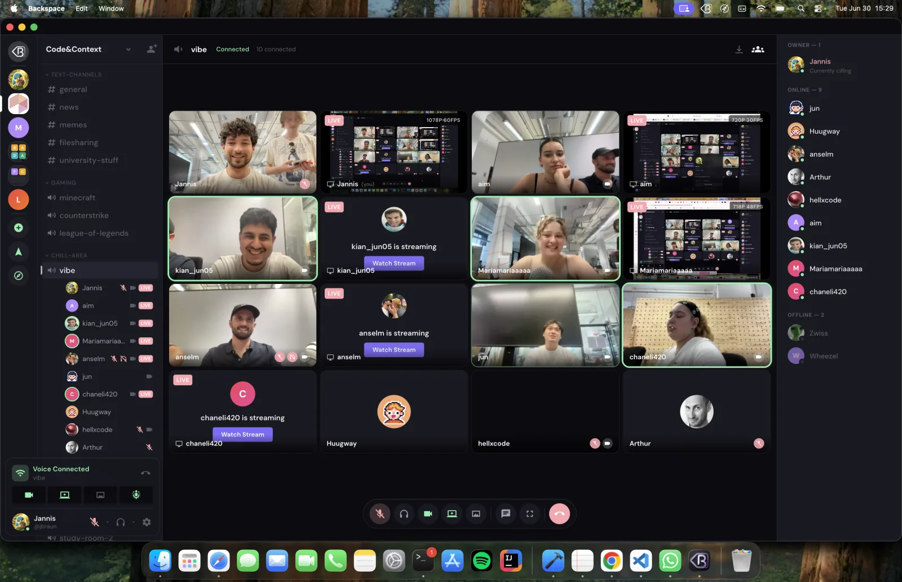
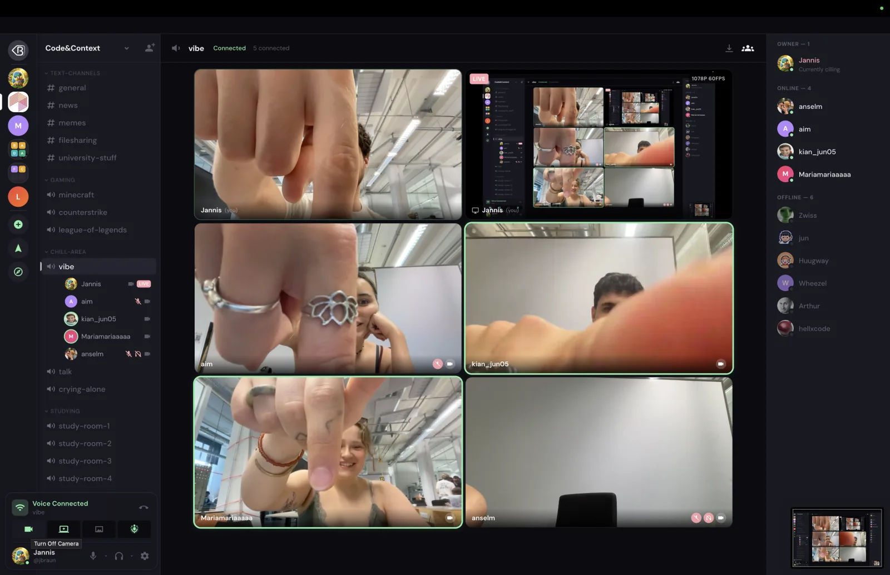
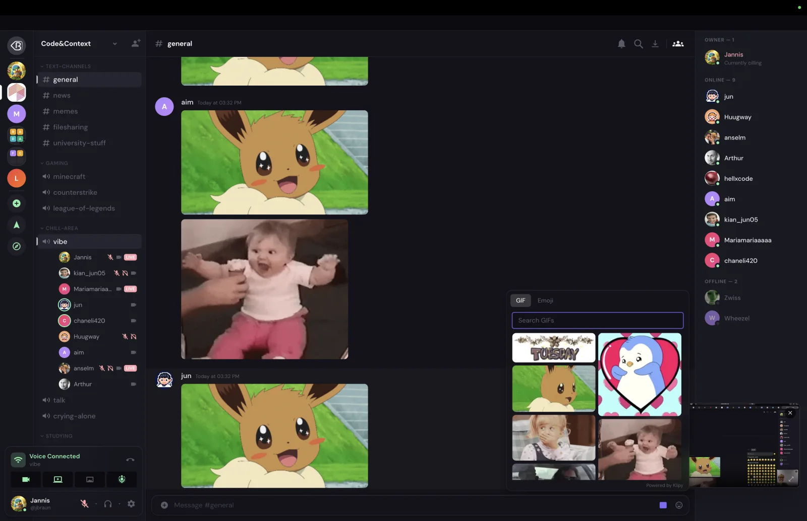
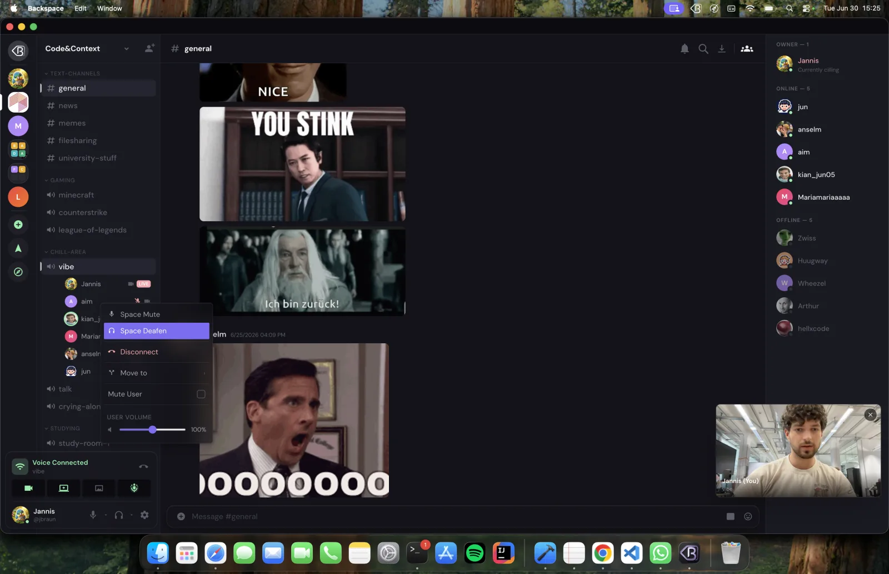
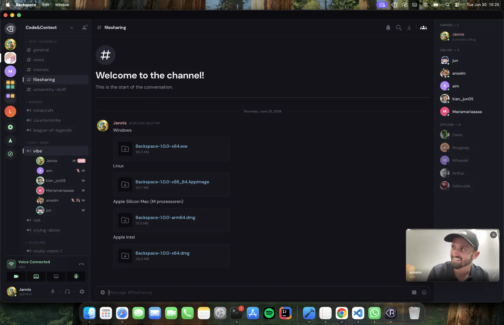
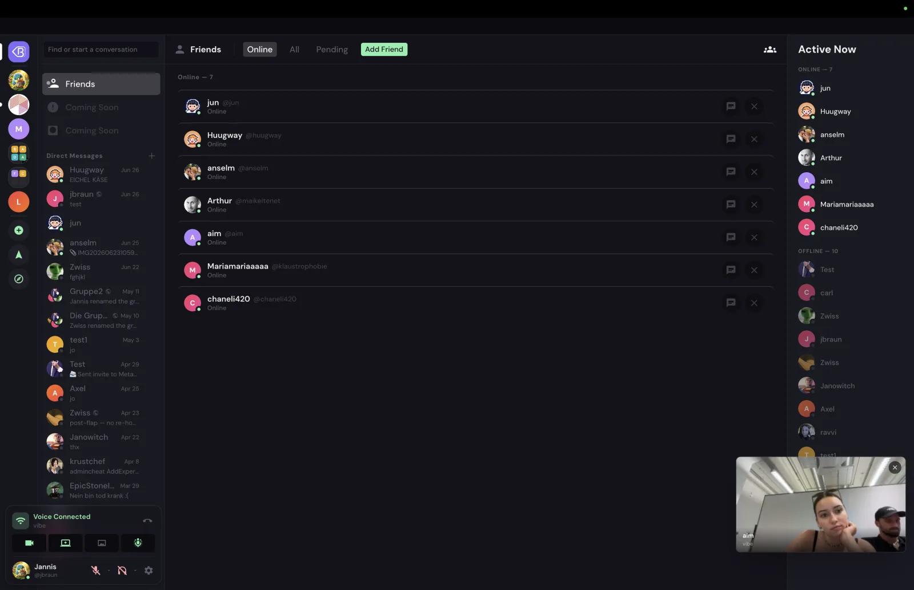
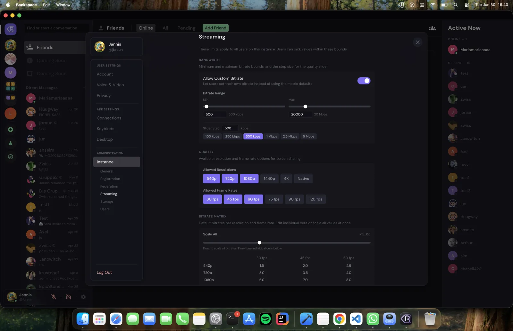

# Screenshots

A tour of Backspace in action, taken from a live test instance. For a quick
overview, see the [Screenshots section of the README](../README.md#screenshots).

> Images are captured from the Electron desktop app; the web app is identical.

## Voice & video

A voice channel scales from a couple of people to a full grid of camera tiles
and live screen-shares, each labelled with its own resolution and frame rate.

   
  Camera tiles and live screen-shares side by side, with per-stream quality labels.

 

   
  Members can go live; others join with a <b>Watch Stream</b> button.

 

   
  Picture-in-Picture keeps the call visible while you browse other channels.

## Text chat

   
  Real-time messages with replies, reactions, and live typing indicators.

 

   
  Built-in GIF search (Klipy) and an emoji picker.

 

   
  Voice moderation — space mute / deafen, move, disconnect, and per-user volume.

## Screen sharing

   
  Per-stream resolution, frame rate, content mode, codec (VP9 / H.264), and bitrate — within admin-set bounds.

## File sharing

   
  Upload and share files of any kind directly in a channel.

## Direct messages

   
  1-on-1 and group DMs, including members on peer instances (note the <code>@instance</code> handles).

## Friends & social

   
  Friends list with presence and an <b>Active Now</b> sidebar.

 

   
  Discover people across instances, with mutual friends and mutual spaces surfaced.

## Spaces

   
  Browse and join public, request-to-join, and already-joined spaces.

## Administration

   
  Federation — DM relay, auto-peering, secret rotation, and per-peer health and management.

 

   
  Streaming limits — allowed resolutions and frame rates, plus a per-resolution × per-frame-rate bitrate matrix.

